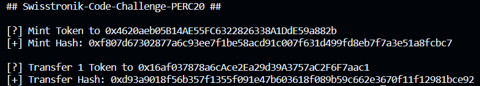

# Swisstronik Code Challenge PERC20

This project demonstrates a basic PERC20 contract, A PERC20 token, deploy the contract to the Swisstronik network, mint and transfer 1 token to 0x16af037878a6cAce2Ea29d39A3757aC2F6F7aac1.

### Build

To compile contracts, use following command:
```sh 
npm run compile
```

### Testing & Deployment

<b>NOTE</b>: tests are not compatible with hardhat network / ganache, so you have to start Swisstronik local node or use public testnet

Create `.env` file from example
```sh
cp example.env .env
```
Add `PRIVATE_KEY` in `.env` with actual private key to interact with network. If you're using other network than local testnet you also should replace `url` in `hardhat.config.js`

To run tests, use following command:

```sh
npm run test
```

To deploy contracts, use check `scripts/deploy.js` script and use following command:
```sh
npm run deploy
npx hardhat run scripts/transaction.js
```

### Sample Result

Information
```
Token Name   : ChainZoku
Token Symbol : CZ
```

Smart Contract
```
0x4620aeb05B14AE55FC6322826338A1DdE59a882b
```

Mint Tx
```
https://explorer-evm.testnet.swisstronik.com/tx/0xf807d67302877a6c93ee7f1be58acd91c007f631d499fd8eb7f7a3e51a8fcbc7
```

Transfer Tx (1 Token to 0x16af037878a6cAce2Ea29d39A3757aC2F6F7aac1)
```
https://explorer-evm.testnet.swisstronik.com/tx/0xd93a9018f56b357f1355f091e47b603618f089b59c662e3670f11f12981bce92
```

Image




### Note
Faucet
```
https://faucet.testnet.swisstronik.com
```